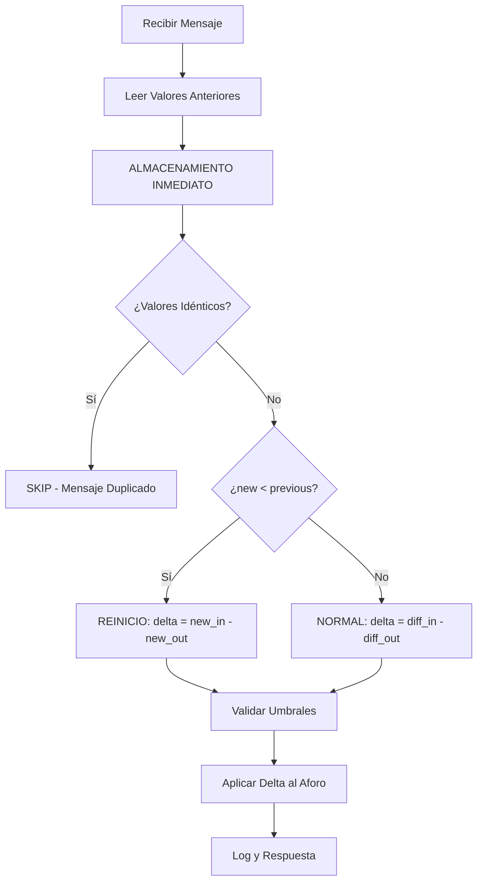

# Implementación Nueva Lógica de Cálculo de Deltas v4.0.0

## 📋 Información del Documento

- **Rama**: v4.0.0
- **Fecha**: 12 de septiembre de 2025
- **Propósito**: Documentación de la implementación de la nueva lógica de cálculo de deltas
- **Estado**: Implementación completada - Lista para despliegue y pruebas

---

## 🎯 Resumen de la Implementación

Se ha implementado exitosamente la nueva lógica de cálculo de deltas v4.0.0 con las siguientes características:

### ✅ Funcionalidades Implementadas

1. **Feature Flag**: `USE_NEW_DELTA_LOGIC` para alternar entre lógicas
2. **Almacenamiento Inmediato**: Los valores se guardan antes del cálculo
3. **Delta Unificado**: Un solo delta final en lugar de delta_in y delta_out separados
4. **Manejo Mejorado de Reinicios**: Usa diferencia absoluta en lugar de ignorar
5. **Validación de Umbrales**: Protección contra deltas excesivos
6. **Logging Detallado**: Diferenciación clara entre lógicas en logs

---

## 🔧 Archivos Modificados

### 1. `src/camera_server.py` (Archivo Principal)

#### Cambios Realizados:
- **Línea 23**: Añadido feature flag `USE_NEW_DELTA_LOGIC = True`
- **Líneas 30-35**: Log de inicio indicando qué lógica está activa
- **Líneas 188-300**: Nuevas funciones de cálculo de deltas
- **Líneas 512-583**: Lógica condicional en `handle_camera()`
- **Líneas 597-613**: Aplicación condicional de deltas al aforo
- **Líneas 699-730**: Logging diferenciado por lógica

#### Nuevas Funciones Añadidas:
```python
def detect_camera_reset_new_logic(previous_in, previous_out, new_in, new_out)
def calculate_deltas_new_logic(previous_in, previous_out, new_in, new_out)
def validate_delta_thresholds(delta_final, is_reset)
```

### 2. `test/test_delta_calculation_v4_0_0.py` (Tests Comparativos)

#### Funcionalidades de Testing:
- Comparación directa entre lógica original y nueva
- Tests de casos extremos y edge cases
- Simulación de día típico de operación
- Validación de rendimiento básica
- Tests de detección de reinicios y duplicados

### 3. `docs/v4.0.0/backup_estado_actual_camera_server.md` (Backup)

#### Contenido del Backup:
- Estado completo del código antes de los cambios
- Procedimiento detallado de rollback
- Casos de test para validación
- Métricas a monitorizar

---

## 🔄 Comportamiento de la Nueva Lógica

### Flujo de Procesamiento (Nueva Lógica):



### Comparación de Comportamientos:

| Escenario | Lógica Original | Nueva Lógica v4.0.0 |
|-----------|----------------|----------------------|
| **Funcionamiento Normal** | `delta = (delta_in - delta_out)` | `delta = (diff_in - diff_out)` |
| **Mensaje Duplicado** | Detectado por cache externa | Detectado post-almacenamiento |
| **Reinicio de Cámara** | `delta = 0` (mantiene ocupación) | `delta = new_in - new_out` (ajusta ocupación) |
| **Orden de Operaciones** | Leer → Calcular → Escribir | Leer → Escribir → Calcular |

---

## 🚀 Instrucciones de Despliegue

### Paso 1: Preparación del Entorno

```bash
# 1. Hacer backup del archivo actual
cp src/camera_server.py src/camera_server.py.backup.$(date +%Y%m%d_%H%M%S)

# 2. Verificar que los cambios están en el repositorio
git status
git add src/camera_server.py test/test_delta_calculation_v4_0_0.py docs/v4.0.0/
git commit -m "feat: Implementar nueva lógica de cálculo de deltas v4.0.0

- Añadir feature flag USE_NEW_DELTA_LOGIC para alternar entre lógicas
- Implementar almacenamiento inmediato y delta unificado
- Mejorar manejo de reinicios con diferencia absoluta
- Añadir validación de umbrales y logging detallado
- Crear tests comparativos completos
- Documentar procedimiento de rollback"
```

### Paso 2: Despliegue en Servidor

```bash
# En el servidor remoto
git pull origin v4.0.0

# Reiniciar el servicio de cámaras
sudo systemctl restart parking-camera.service

# Verificar que el servicio inició correctamente
sudo systemctl status parking-camera.service

# Verificar logs de inicio
sudo journalctl -u parking-camera.service -f --since "1 minute ago"
```

### Paso 3: Verificación del Despliegue

Buscar en los logs la confirmación de que la nueva lógica está activa:
```
🚀 CAMERA SERVER v4.0.0 - NEW DELTA LOGIC ENABLED
Features: Immediate storage, unified delta calculation, improved reset handling
```

---

## 🧪 Plan de Pruebas en Servidor

### Fase 1: Monitorización Inicial (30 minutos)

```bash
# Monitorizar logs en tiempo real
sudo journalctl -u parking-camera.service -f

# Buscar indicadores clave:
# - "Using NEW DELTA LOGIC v4.0.0"
# - "NEW LOGIC - Delta final: X"
# - "Occupancy updated (NEW LOGIC)"
```

**Indicadores de Éxito:**
- ✅ Mensajes procesados con nueva lógica
- ✅ No errores críticos en logs
- ✅ Ocupaciones actualizándose correctamente

**Señales de Alerta:**
- ❌ Errores de cálculo de deltas
- ❌ Ocupaciones con valores anómalos
- ❌ Incremento significativo en errores

### Fase 2: Pruebas Funcionales (2 horas)

#### Test 1: Funcionamiento Normal
```bash
# Enviar mensaje de prueba simulando funcionamiento normal
curl -X POST http://localhost:6400/camera \
  -H "Content-Type: application/json" \
  -d '{
    "device": "TEST_CAMERA",
    "line": 0,
    "Vehicle In": 100,
    "Vehicle Out": 95,
    "event": "test",
    "time": "2025-09-12T10:00:00"
  }'

# Verificar en logs: "NEW LOGIC - Delta final: 5"
```

#### Test 2: Mensaje Duplicado
```bash
# Enviar el mismo mensaje dos veces
curl -X POST http://localhost:6400/camera \
  -H "Content-Type: application/json" \
  -d '{
    "device": "TEST_CAMERA",
    "line": 0,
    "Vehicle In": 100,
    "Vehicle Out": 95,
    "event": "test",
    "time": "2025-09-12T10:01:00"
  }'

# Verificar en logs: "DUPLICATE MESSAGE DETECTED (NEW LOGIC)"
```

#### Test 3: Reinicio de Cámara
```bash
# Simular reinicio con contadores menores
curl -X POST http://localhost:6400/camera \
  -H "Content-Type: application/json" \
  -d '{
    "device": "TEST_CAMERA",
    "line": 0,
    "Vehicle In": 5,
    "Vehicle Out": 2,
    "event": "test",
    "time": "2025-09-12T10:02:00"
  }'

# Verificar en logs: "Reset detected (NEW LOGIC) - Using absolute difference: 5 - 2 = 3"
```

### Fase 3: Monitorización Extendida (24 horas)

#### Métricas a Monitorizar:

```bash
# Script de monitorización
#!/bin/bash
echo "=== MONITORIZACIÓN NUEVA LÓGICA v4.0.0 ==="
echo "Fecha: $(date)"
echo

# Contar mensajes procesados por lógica
echo "📊 ESTADÍSTICAS DE PROCESAMIENTO (últimas 24h):"
sudo journalctl -u parking-camera.service --since "24 hours ago" | \
  grep -c "NEW LOGIC - Delta final" | \
  xargs -I {} echo "Mensajes procesados con nueva lógica: {}"

sudo journalctl -u parking-camera.service --since "24 hours ago" | \
  grep -c "Reset detected (NEW LOGIC)" | \
  xargs -I {} echo "Reinicios detectados: {}"

sudo journalctl -u parking-camera.service --since "24 hours ago" | \
  grep -c "DUPLICATE MESSAGE DETECTED (NEW LOGIC)" | \
  xargs -I {} echo "Duplicados detectados: {}"

# Errores relacionados con nueva lógica
echo
echo "⚠️  ERRORES DETECTADOS:"
sudo journalctl -u parking-camera.service --since "24 hours ago" | \
  grep -i "error.*new logic" | wc -l | \
  xargs -I {} echo "Errores con nueva lógica: {}"
```

---

## 🔄 Procedimiento de Rollback

### Situaciones que Requieren Rollback:

1. **Errores Críticos**: Fallos en el procesamiento de mensajes
2. **Ocupaciones Anómalas**: Valores excesivamente altos o negativos
3. **Degradación de Rendimiento**: Aumento significativo en tiempo de respuesta
4. **Incompatibilidades**: Problemas con otros componentes del sistema

### Pasos de Rollback:

#### Opción 1: Cambiar Feature Flag (Rollback Rápido)
```python
# En src/camera_server.py, línea 23
USE_NEW_DELTA_LOGIC = False  # Cambiar a False
```

```bash
# Reiniciar servicio
sudo systemctl restart parking-camera.service

# Verificar logs
sudo journalctl -u parking-camera.service -f --since "1 minute ago"
# Debe aparecer: "📜 CAMERA SERVER - LEGACY DELTA LOGIC ENABLED"
```

#### Opción 2: Rollback Completo (Si hay problemas con el código)
```bash
# Restaurar backup
cp src/camera_server.py.backup.YYYYMMDD_HHMMSS src/camera_server.py

# Reiniciar servicio
sudo systemctl restart parking-camera.service
```

#### Opción 3: Rollback por Git
```bash
# Revertir commit específico
git revert <commit_hash_de_implementacion>

# O resetear a commit anterior
git reset --hard <commit_hash_anterior>
git push --force-with-lease origin v4.0.0
```

---

## 📊 Métricas de Éxito

### KPIs a Monitorizar:

#### Funcionalidad:
- ✅ **Tasa de éxito**: >99% de mensajes procesados sin error
- ✅ **Detección de reinicios**: Coherente con patrones históricos
- ✅ **Ocupaciones**: Dentro de rangos esperados para cada parking

#### Rendimiento:
- ✅ **Tiempo de respuesta**: <100ms por mensaje
- ✅ **Throughput**: Capacidad de procesar picos de tráfico
- ✅ **Memoria**: Sin aumentos significativos en uso

#### Calidad de Datos:
- ✅ **Consistencia**: Ocupaciones coherentes entre actualizaciones
- ✅ **Precisión**: Deltas dentro de umbrales razonables
- ✅ **Completitud**: No pérdida de mensajes

---

## 🔍 Debugging y Troubleshooting

### Comandos Útiles para Debugging:

```bash
# Ver logs específicos de nueva lógica
sudo journalctl -u parking-camera.service | grep "NEW LOGIC"

# Monitorizar deltas en tiempo real
sudo journalctl -u parking-camera.service -f | grep "Delta final"

# Verificar reinicios detectados
sudo journalctl -u parking-camera.service | grep "Reset detected"

# Buscar errores de validación
sudo journalctl -u parking-camera.service | grep "Delta excesivo"
```

### Problemas Comunes y Soluciones:

#### Problema 1: Deltas Excesivos
```
Síntoma: "Delta excesivo detectado: 150, umbral: 50"
Solución: Verificar si es un caso real o ajustar umbrales en validate_delta_thresholds()
```

#### Problema 2: Ocupaciones Negativas
```
Síntoma: Ocupación del parking se vuelve negativa
Solución: Revisar lógica de reinicios, posible problema con contadores base
```

#### Problema 3: Duplicados No Detectados
```
Síntoma: Mensajes duplicados procesándose como válidos
Solución: Verificar que la detección post-almacenamiento funcione correctamente
```

---

## 📚 Referencias y Documentación

### Documentos Relacionados:
- `docs/v4.0.0/analisis_nueva_logica_calculo_deltas.md` - Análisis original
- `docs/v4.0.0/backup_estado_actual_camera_server.md` - Backup y rollback
- `test/test_delta_calculation_v4_0_0.py` - Tests comparativos

### Archivos de Código:
- `src/camera_server.py` - Implementación principal
- `src/models.py` - Modelos de base de datos
- `src/config.py` - Configuración del sistema

---

## ✅ Checklist de Implementación

### Pre-Despliegue:
- [x] Código implementado y probado localmente
- [x] Feature flag configurado
- [x] Tests comparativos creados
- [x] Documentación completa
- [x] Backup del estado actual documentado
- [x] Procedimiento de rollback definido

### Post-Despliegue:
- [ ] Servicio reiniciado correctamente
- [ ] Nueva lógica activa confirmada en logs
- [ ] Tests funcionales ejecutados
- [ ] Métricas de rendimiento monitorizadas
- [ ] No errores críticos en 24h
- [ ] Stakeholders notificados del éxito

---

*Documento de implementación completado el 12 de septiembre de 2025*
*Estado: Lista para despliegue en servidor remoto*
